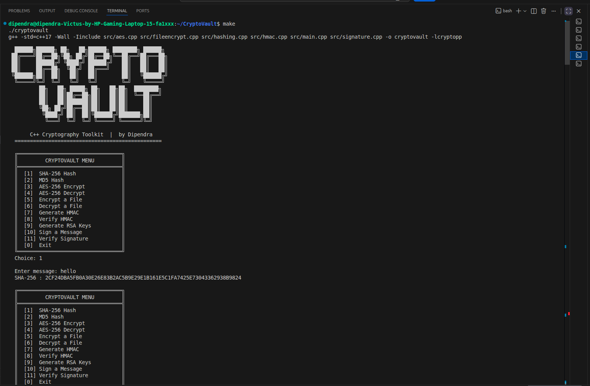
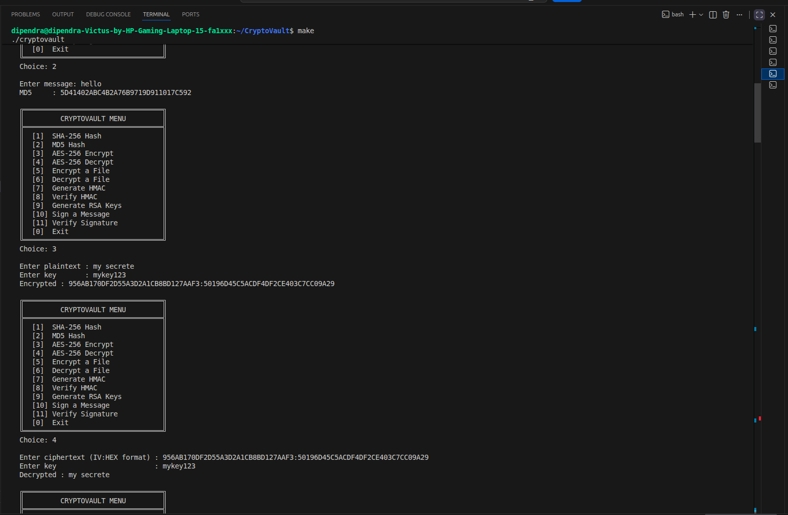
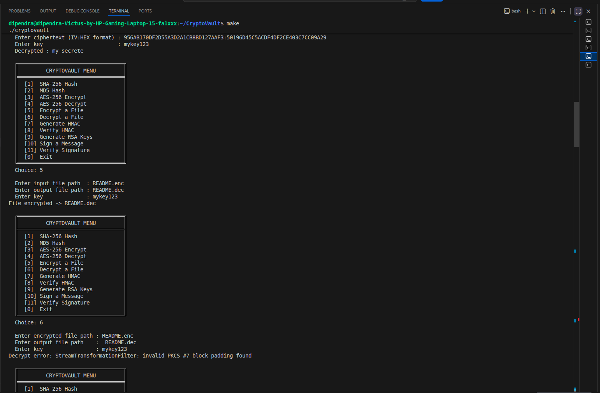
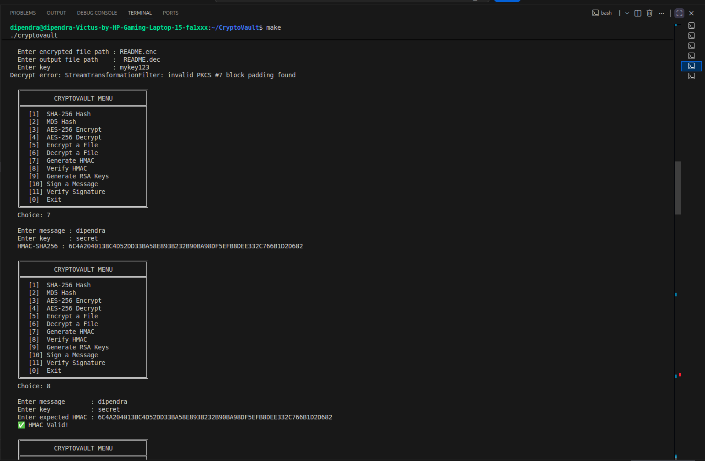
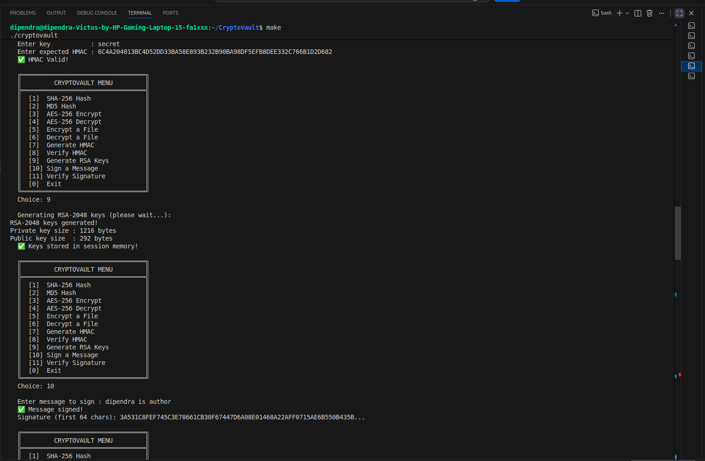
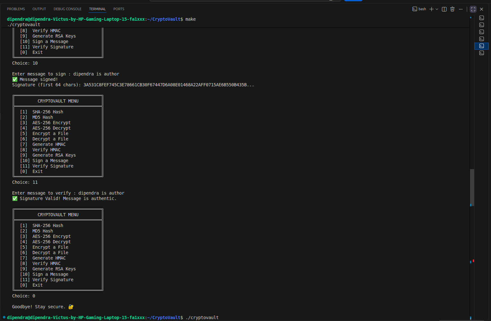
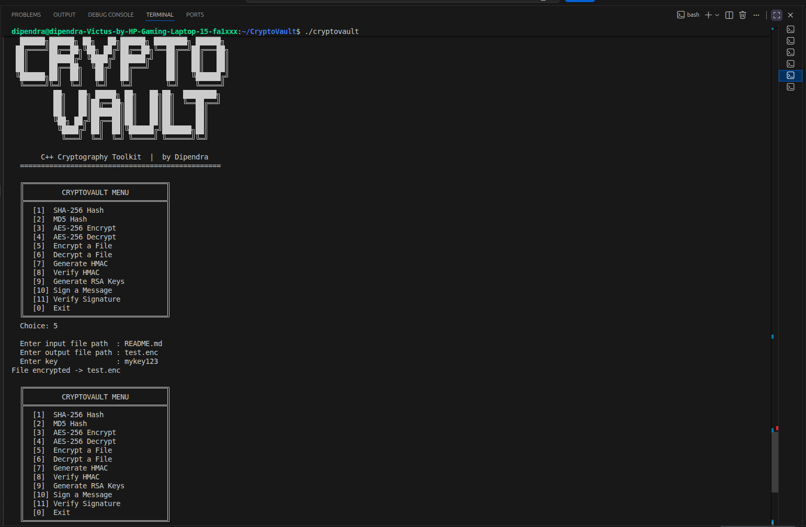
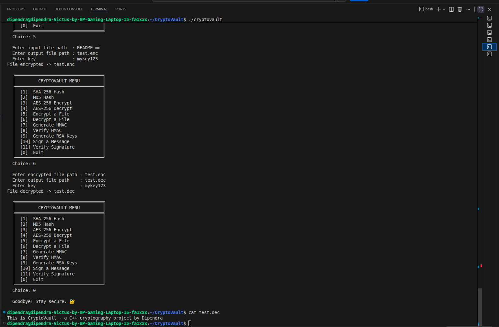

# 🔐 CryptoVault


A command-line cryptography toolkit built in **C++17** using the [Crypto++](https://cryptopp.com/) library. Implements real-world security algorithms used in banking, blockchain, and secure communications.

---

## 📸 Preview



---

## ✨ Features

| Module | Algorithm | Description |
|---|---|---|
| Hashing | SHA-256 | One-way 256-bit digest |
| Hashing | MD5 | Legacy 128-bit digest |
| Symmetric Encryption | AES-256-CBC | Random IV, industry standard |
| File Encryption | AES-256-CBC | Encrypt/decrypt any file |
| Authentication | HMAC-SHA256 | Tamper detection |
| Asymmetric Crypto | RSA-2048 | Key pair generation |
| Digital Signature | RSA + SHA-256 | Sign & verify messages |

---

## 🖥️ Screenshots

### Main Menu


### Hashing (SHA-256 & MD5)


### AES-256 Encryption & Decryption


### File Encryption & Decryption


### HMAC Authentication


### RSA Key Generation


### Digital Signature — Sign


### Digital Signature — Verify


---

## 🛠️ Installation

### Prerequisites
```bash
sudo apt update
sudo apt install libcrypto++-dev libcrypto++-utils
```

### Clone & Build
```bash
git clone https://github.com/Dipendra367/CryptoVault-cpp.git
cd CryptoVault-cpp
make
./cryptovault
```

---

## 📁 Project Structure

**`src/`** — Source files
- `main.cpp` — Menu-driven interface
- `hashing.cpp` — SHA-256 & MD5 hashing
- `aes.cpp` — AES-256-CBC encrypt/decrypt
- `fileencrypt.cpp` — File encryption/decryption
- `hmac.cpp` — HMAC-SHA256 authentication
- `signature.cpp` — RSA-2048 digital signatures

**`include/`** — Header files
- `hashing.h`, `aes.h`, `fileencrypt.h`, `hmac.h`, `signature.h`


---

## 🔑 How It Works

- **AES-256** uses a **random IV** generated per encryption — same plaintext produces different ciphertext every time, preventing pattern analysis
- **HMAC** appends a secret-key-based signature to messages — any tampering changes the MAC and fails verification
- **RSA Digital Signatures** use your private key to sign and anyone with your public key can verify — this is how SSL certificates and package managers work
- **File encryption** stores the IV in the first 16 bytes of the encrypted file, allowing correct decryption later

---
## 💻 Usage Example

**Encrypt a message:**
1. Choose option `[3]` from the menu
2. Enter your plaintext and a key
3. Copy the encrypted output (format: `IV:CIPHERTEXT`)

**Decrypt a message:**
1. Choose option `[4]` from the menu
2. Paste the encrypted output and same key
3. Original message is recovered


---

## 🌍 Real World Applications

- WhatsApp & Signal use **AES-256** for message encryption
- Bitcoin mining uses **SHA-256** for proof of work
- GitHub uses **SHA-256** to identify every commit
- Banks use **HMAC** to authenticate API requests
- SSL certificates use **RSA** for identity verification

---

## 🚀 Future Plans

- [ ] Secure Notes App — encrypt notes with AES before saving to disk
- [ ] Password Manager — store credentials encrypted
- [ ] GUI with Qt
- [ ] File drag-and-drop encryption

---

## 👨‍💻 Author

**Dipendra** — Bachelor of Software Engineering, Pokhara University

---

## 📄 License

This project is licensed under the MIT License.
